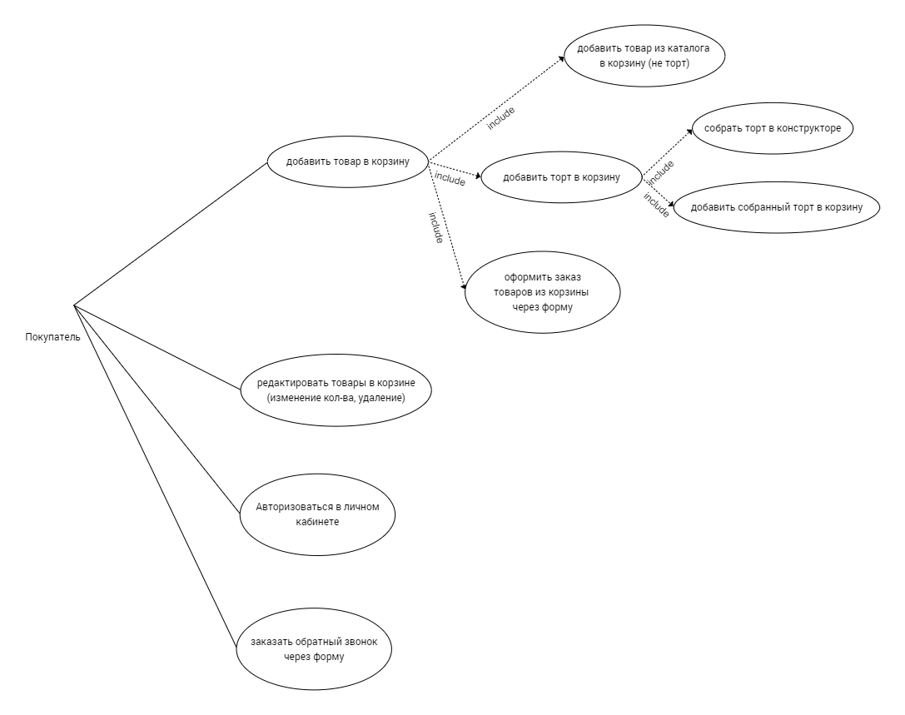
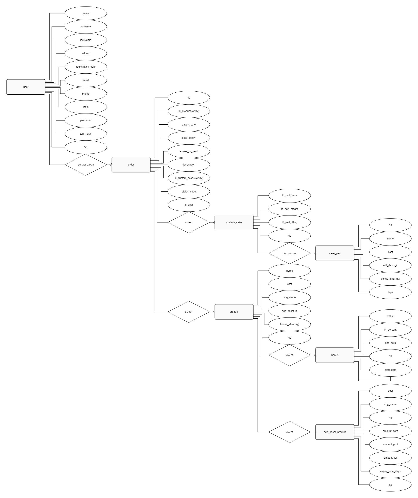
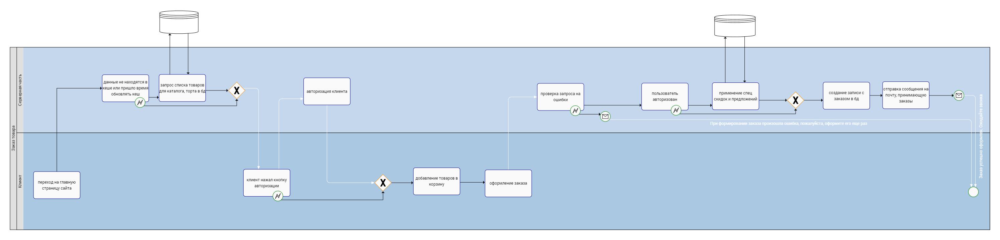
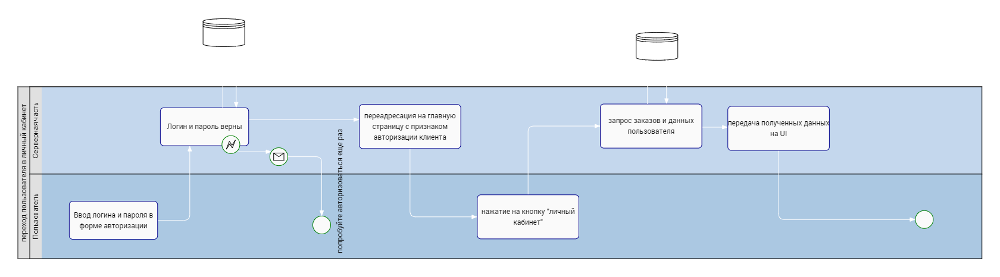
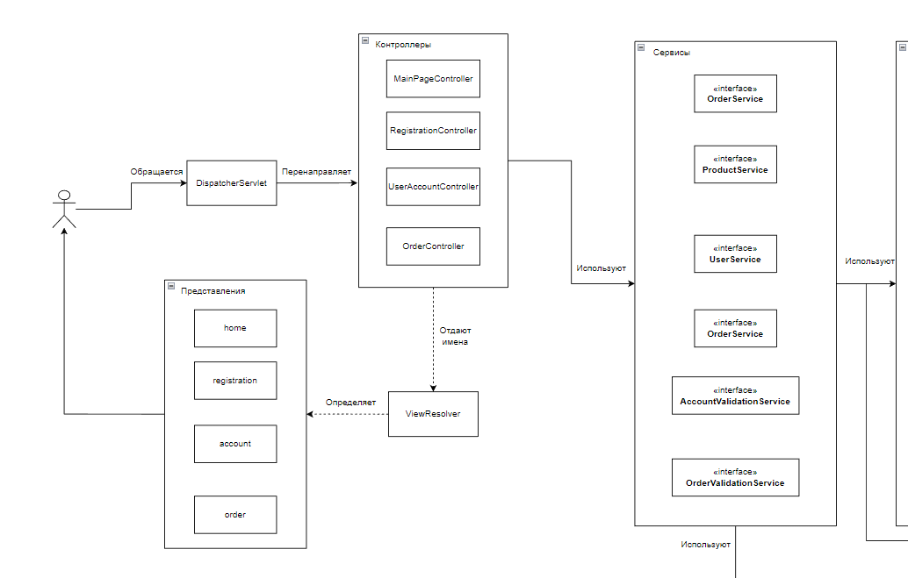
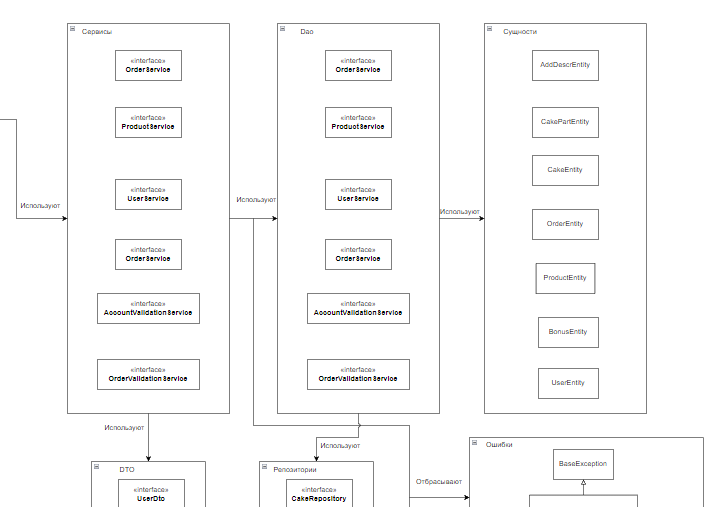
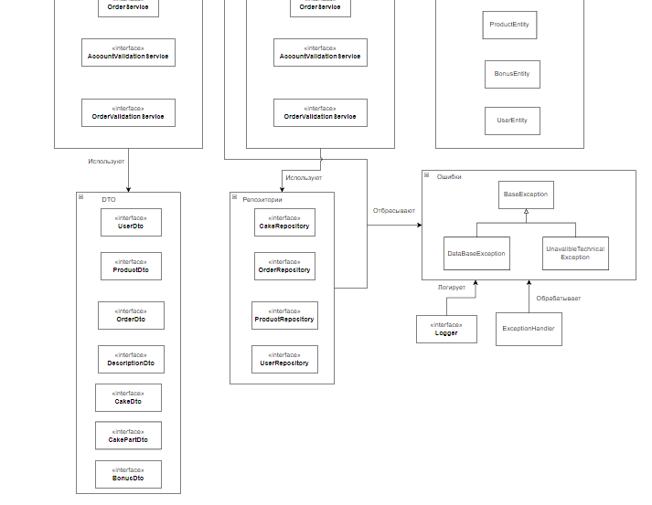
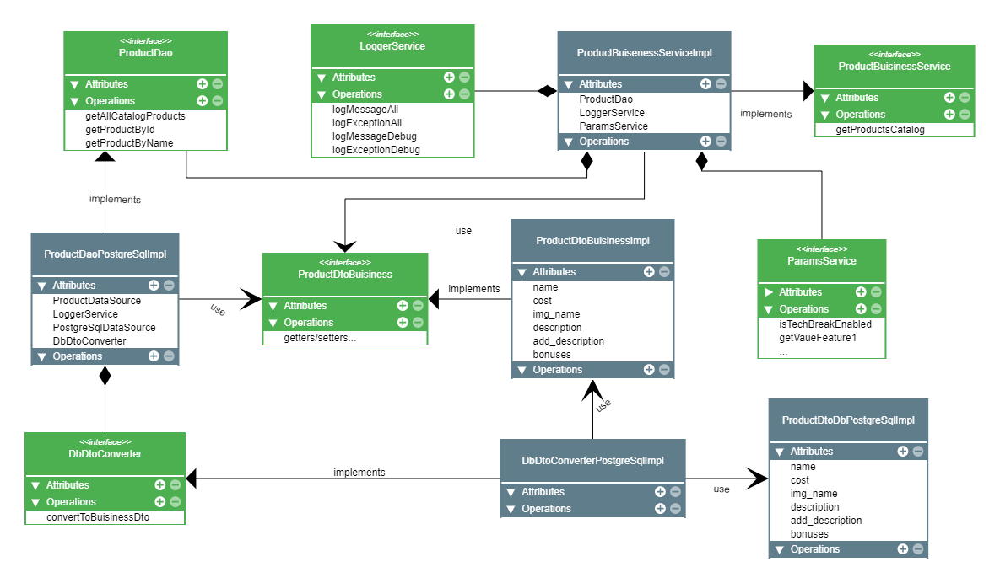
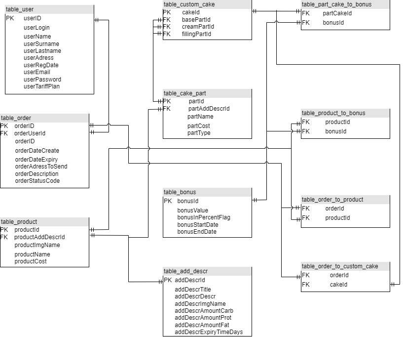
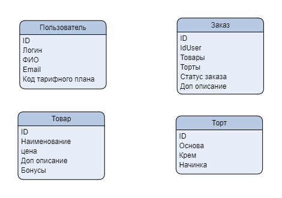

# Интернет магазин по продаже выпечки

## Краткое описание

Интернет-магазин, который позволяет пользователям делать заказы у частной 
пекарни, тем самым автоматизируя процесс обработки заказов и общения 
с клиентами.

## Краткое описание предметной области

Предметной область - продажа безглютеновой выпечки. Пользователь должен иметь 
возможность просмотреть все имеющиеся товары данной пекарни, и сделать заказ,
авторизировавшись на сайте.

## Анализ аналогичных решений

| Критерий                          | pekulana.ru | soyoucan.ru | esh-derevenskoe.ru |
|-----------------------------------|-------------|-------------|--------------------|
| Авторизация в личном кабинете | -           | -           | +                  |
| Конструктор торта                 | -           | -           | -                  |
| Возможность обратного звонка      | +           | -           | +                  |

## Краткое обоснование целесообразности и актуальности проекта

Данный проект актуален с точки зрения предметной области в том, что
сейчас наблюдаются все большие тенденции к здоровому питанию, а безглютеновая
выпечка - это здоровая альтернатива привычных нам "нездоровых" кондитерских 
изделий. Актуальность и целесообразность с точки зрения обучения заключается
в том, что те подходы и технологии в веб-программировании, которые будут
использоваться в данной работе являются широкоприменяемой базой в большиестве
веб-проектов.

## Use-Case - диаграмма

## ER-диаграмма сущностей

## Пользовательские сценарии (в текстовом виде)

### Сценарий 1

**Описание пользователя**:

Пользователь, ранее не знакомый с производителем, но заинтересованный в покупке безглютеновой выпечки
заходит на сайт

**Цель пользователя**:

Оценить, можно ли покупать выпечку у данного производителя, и купить ее, если это так

**Объекты взаимодействия**:

- Главная секция страници. На ней рассказывается история производителя, его преимущества по сравнению с конкурентами.
- Каталог. Здесь пользователь изучает товары, доступные для заказа, и добавляет понравившиеся товары в корзину
- Конструктор торта. Если пользователь заинтересован в покупке торта, а так же, ему либо не приглянулись готовые
торты в каталоге, либо он целенаправленно хочет сделать свой уникальный торт, то это происходит в конструкторе торта
- Корзина. После того, как пользователь выбрал интересующие его товары, он переходит к оформлению заказа через корзину
- Авторизация. Клиенту предлагается авторизоваться на сайте/войти в свой аккаунт при оформлении заказа. Таким 
образом можно будет не вводить данные каждый раз при оформлении заказа, и в будущем, возможно, получать бонусы
за N-e кол-во заказов

### Сценарий 2

**Описание пользователя**:

У пользователя, изучившего сайт остались какие-либо вопросы по поводу оформления заказа. Он ищет способ связи
с пекарней напрямую

**Цель пользователя**:

Связаться с пекарней по телефону/в переписке

**Объекты взаимодействия**:

- Главная страница. Ее изучаеть пользователь в поисках ответов на интересующие его вопросы
- Форма обратной связи. Ей пользуется клиент для того, чтобы заказать обратный звонок

### Сценарий 3

**Описание пользователя**:

Пользователь, делавший ранее заказы хочет посмотреть историю своих заказов, либо статус какого-либо заказа

**Цель пользователя**:

Посмотреть информацию о заказе

**Объекты взаимодействия**:

- Главная страница. Здесь пользователь переходит на экран авторизации
- Авторизация. Здесь пользователь авторизируется под своей учетной записью
- Личный кабинет. Здесь пользователь может найти историю своих заказов

## Формализация бизнес-правил (в виде BPMN)

##  Описание типа приложения и выбранного технологического стека

Приложение будет представлять собой Web MPA (web из-за того, что это интернет-магазин, а mpa - из-за того, что
в нем будет система авторизации пользователя в личном кабинете и просмотра заказов, что логичнее сделать на отдельных
экранах).

В качестве технологического стека будет использован Kotlin с библиотекой Spring Boot. Субд - PostgreSql

## Верхнеуровневое разбиение на компоненты (диаграмма компонентов)

В диаграмме разбиении предполагается, что все элементы являются интерфейсами, 
у которых будет как минимум одна реализация:

## UML диаграммы

### Диаграмма продуктового бизнес-сервиса 
Все остальные бизнес-сервисы реализуются аналогичным образом с тем учетом,
что они работают с другими сущностями бд

### UML диаграмма сущностей базы данных

### Сущности системы

### Транспортные сущности

Будут спроектированы в дальнейших лаборатороных

